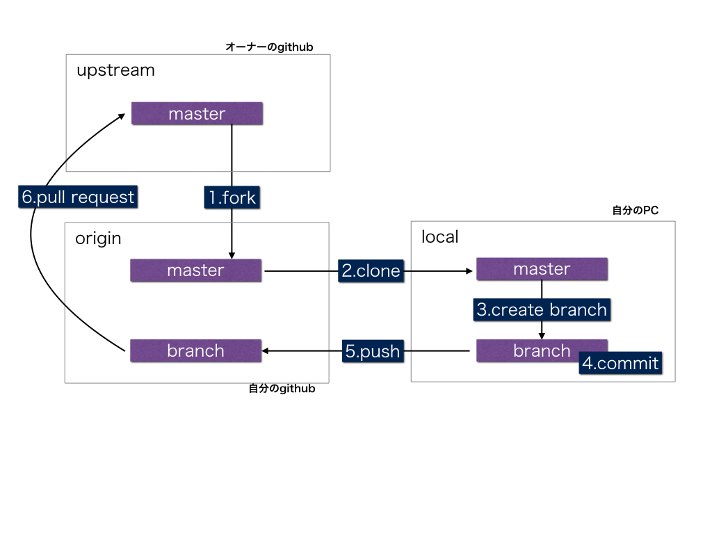

## GitHubの使い方

Githubは、プログラマが共同で作業するときに、ファイルの同期をとる仕組み。

文書のオーナーがファイルを公開する。利用者はそのコピーを作り(fork)、さらに自分のPCに転送して(clone)、
書き足したり、修正したりする(commit/push)。最終的にファイルをオーナーに送り返す(pull request)。オーナーは修正を採用・拒絶することができる。
github/gitは、commitのたびに修正履歴を保存するので、いつでも任意の（過去の）状態に戻すことができる。



### 簡単なGithub Desktop（初心者はこれが簡単）

<https://desktop.github.com/>から専用アプリを入手、インストールする。
ただし、fork/clone/pushの関係は理解しないと使えないだろう。

### コマンドラインのgit（上級者用）

githubは、バージョン管理ソフトであるgitをネットで公開できるようにしたものに過ぎない。

#### setup(初回だけ)
まず、homebrew経由でgitをインストールし、自分の名前とメールアドレスを設定する。

```
	$ git config --global user.name "<YOUR_NAME>"
	$ git config --global user.email "<YOUR_EMAIL_ADDRESS>"
```

GitHubとの通信はHTTPSが推奨されている。毎回名前とパスワードを入力するのは大変なので、credential helperを作って自動化する。

Macの場合、osxkeychain credential helperがすでにインストールされている。

```
	$ git credential-osxkeychain
	  / インストールされていれば以下のようにusageが出る
	$ Usage: git credential-osxkeychain <get|store|erase>
	  / Gitにcredentialを使うように設定する
	$ git config --global credential.helper osxkeychain
```

Windowsの場合

```
	# git config --global credential.helper wincred
```

#### github側にレポジトリを作成する

これは黙ってweb上でやる。
Githubでは「リポジトリ」にすべてのプロジェクトを保存する。
ブラウザで自分のgituhubページを表示し、ページの右上の＋ボタンで、「New repository」を押して、Repository name/Repository description/を記入する。

自動で作成されるREADME.mdファイルは、リポジトリの内容を説明するページで、強制的にリポジトリの表紙になる。

markdown形式で書くと、自動で装飾される。

参考：githubのマークダウン<https://gist.github.com/wate/7072365>

#### レポジトリをforkする

Forkとは、他人（オーナー）のレポジトリを自分のgithubアカウントにコピーすること。

他人のリポジトリは、その人が随時編集していいのだから、文書のバージョンはいつでも変わりうる。
だから、バージョンを枝分かれ(fork)させる。

Gitのようにグループで編集する場合、forkして、それぞれが文書を改修し、
それを採用するよう、オーナーに依頼（Pull request）するという手続きをとる。

Githubの場合、forkボタンを押せばよい。（自分のアカウントにコピーができる）

#### レポジトリのcloneをとる

Gitを使う場合、

```
	$ git clone https://github.com/<YOUR-USERNAME>/<PROJECT-NAME>
```

で、forkしたものをローカルに（自分のPCに）コピーする。

#### レポジトリを編集する

手元のリポジトリは単なるコピーなので、自由に編集してもよい。

とはいえ、gitにバージョン管理を頼む以上、gitにバージョンが変わったことを通知する必要がある。
コミットとは、ある時点の全ファイルのスナップショットをとることで、コミットが指示されると、
gitは（把握している）ファイルのコピーを作り、前のバージョンとの相違を把握する。

gitは通常は表示されない.gitファイルに編集履歴を保存している。

ファイルを更新したり、新設したりしたことをgitは勝手に把握してくれるわけではない。
編集したり、新しいファイルを追加したり、削除したりした場合、gitにも伝えなければならない。

```
	$ git add <filename>  //  *.txtのようにワイルドカードも使うことができる
	$ git rm <filename>   // 完全削除
	$ git rm --chached <filename>  // ファイルは残すが、gitは管理しない
	$ git status   // 現状が分かる
```

ある程度修正を行った後、その時点の全ファイルの状態をスナップショットとして保存することをcommitという。
-mオプションとともにメモを追加できる。

```
	$ git commit -m “新しいfileを追加しました”
	// -aオプションをつけると、変更ファイルを全部コミットしてくれる
```

これをGithubにアップロードするには

```
	$ git push
```

#### レポジトリの同期をとる

forkしたもののの、しばらく放置すれば、オーナーがオリジナルを編集してしまい、取り残されてしまう。
オーナーの編集に追いつくには、同期を取らなければならない。
（最も簡単なのは、同期を取るのではなく、古いforkを捨てて、新しくforkすればよい）

オリジナル(upstream)と同期を取る場合、cloneのディレクトリに移動してから、オリジナルとの関係を確認する。

```
	$ git remote -v
	origin  https://github.com/<YOUR_USERNAME>/<YOUR_FORK.git (fetch)
	origin  https://github.com/<YOUR_USERNAME>/<YOUR_FORK.git (push)
```

originだけでupstream（オリジナル）がない。以下のコマンドで、オリジナルとの関係を登録する。

```
	$ git remote add upstream https://github.com/<ORIGINAL_OWNER>/<ORIGINAL_REPOSITORY>.git
```

もう一度確認すると、upstreamが登録されていることがわかる。

```
	$ git remote -v
	origin    https://github.com/<YOUR_USERNAME>/<YOUR_FORK>.git (fetch)
	origin    https://github.com/<YOUR_USERNAME>/<YOUR_FORK>.git (push)
	upstream  https://github.com/<ORIGINAL_OWNER>/<ORIGINAL_REPOSITORY>.git (fetch)
	upstream  https://github.com/<ORIGINAL_OWNER>/<ORIGINAL_REPOSITORY>.git (push)
```

fetchコマンドでオリジナルとダウンロードする。

```
	$ git fetch upstream
```
これによって、upstream/masterというオリジナルの修正部分がダウンロードされる。

ローカルのmasterバージョンに移動して、upstream/masterと統合する。
これは、オリジナルの修正による、ローカルのcommitにすぎない。

```
	$ git checkout master
	$ git merge upstream/master
```

### 参考資料

FAQ：<https://help.github.com/>
git早見表：<https://training.github.com/kit/downloads/ja/github-git-cheat-sheet.pdf>
